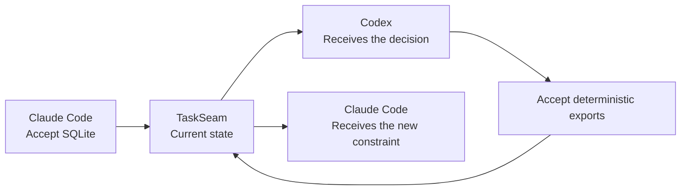

# I got tired of re-explaining my project every time I switched AI coding agents

I use different AI coding agents for different parts of development. One may help me explore a design, another may implement it, and a third may review the result.

The code moves easily because Git already handles that. The difficult part is moving the current understanding of the work: what we accepted, which idea was replaced, what remains unresolved, and why.

Every switch used to begin with reconstruction. I would paste an earlier conversation, write another summary, or explain the same decisions again. Sometimes the new agent followed an outdated proposal because the summary did not preserve which decision had superseded it.

That is the problem I started TaskSeam to explore.

## Context is larger than a transcript

A transcript records what people and models said. It does not directly represent what is authoritative now.

During a design discussion, an agent may suggest Markdown, SQLite, and a hosted database. Only one option may ultimately be accepted. A useful continuation should carry the accepted decision, preserve the unresolved questions, and retain enough source evidence to explain where each item came from.

Sending the complete transcript to every agent creates noise and may disclose unrelated material. Sending only the latest summary can flatten disagreement and erase the decision history.

TaskSeam takes a narrower approach: it maintains a small current state for each project.

## What TaskSeam stores

The current alpha tracks four kinds of information:

- **Decisions** explicitly accepted for the project.
- **Constraints** that remain active.
- **Questions** that have not been resolved.
- **Source evidence** showing where each item originated.

It also records when one decision supersedes another and what each connected agent has already received.

This makes a continuation answer a more useful question:

> What changed since this agent last worked on the project?

## A concrete example

Suppose I discuss storage with Claude Code and accept SQLite as the authoritative local store. Later, while working in Codex, I add a constraint that Markdown exports must be deterministic so Git diffs remain stable.

When I return to Claude Code, it should not need the entire Codex conversation. It needs the one new constraint, its source, and the current accepted state.



TaskSeam computes that continuation separately for each agent.

## Why local-first

Project decisions and conversation evidence can be sensitive. TaskSeam stores project state in `.taskseam/state.db` on the user's computer. It does not require a TaskSeam account or hosted synchronization service.

Connected agents access the state through a local MCP server. Durable writes use the agent host's approval flow, so a model suggestion does not silently become project truth.

The local model also creates clear limitations. State does not automatically synchronize across computers, and browser integrations require a separate reviewed capture flow. Those are explicit product boundaries in the current alpha.

## How this differs from generic AI memory

General memory systems are useful for retrieving facts that might be relevant. TaskSeam is focused on the current state of work.

That distinction requires more than storing notes. TaskSeam must preserve whether an item is accepted or unresolved, recognize replacements, attach provenance, and avoid repeatedly sending an agent information it already received.

The goal is not to make an agent remember everything. The goal is to let it continue correctly.

## Try it

Install TaskSeam:

```bash
pipx install taskseam
taskseam setup
```

Initialize a project:

```bash
cd your-project
taskseam init
```

Then open the project in Codex or Claude Code and ask:

> Continue this project. What accepted decisions, constraints, and open questions should I know?

TaskSeam is an early open-source alpha. I am looking for feedback from people who switch between coding agents during real work, especially cases where the current state becomes ambiguous or stale.

- [GitHub repository](https://github.com/TaskSeam/taskseam)
- [Public website](https://taskseam.github.io/taskseam/)
- [Python package](https://pypi.org/project/taskseam/)

TaskSeam was created by **Sai Sandeep Kantareddy** and is available under the Apache-2.0 license.
